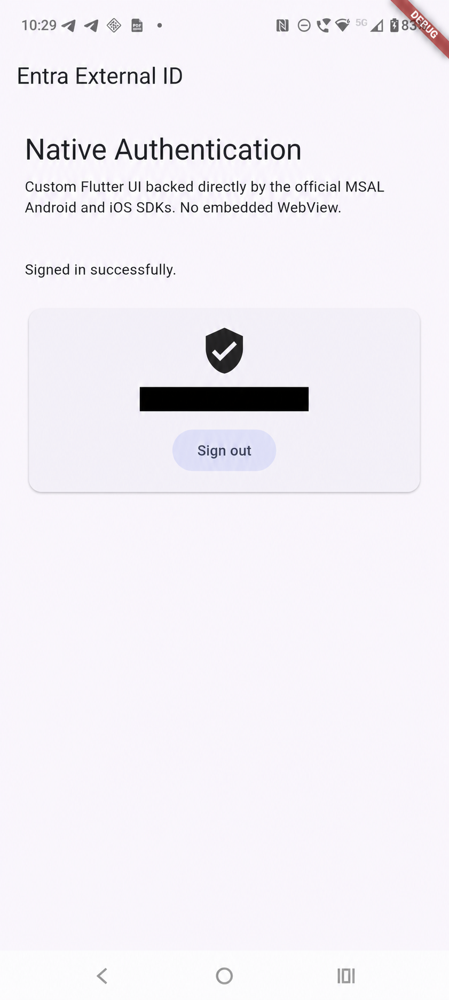

# Entra External ID for Flutter

[](https://github.com/Wreos/microsoft_entra_external_id/actions/workflows/ci.yml)

An unofficial Flutter plugin for Microsoft Entra External ID Native
Authentication, backed by the official MSAL Android and iOS SDKs.

It lets Flutter applications build fully custom sign-up and sign-in experiences
while MSAL handles the authentication protocol, native token cache, and
platform-specific behavior. Native-supported flows do not use an embedded
WebView.

## Custom Flutter UI, native authentication



The screenshot shows a real Email OTP sign-in against an External ID tenant on
an Android device. The account identifier is redacted.

## What the plugin enables

- a Flutter plugin for Android and iOS, implemented in Kotlin and Swift;
- a typed Pigeon channel shared by Dart and the native platforms;
- exact native SDK pins: MSAL Android `8.4.2` and MSAL iOS `2.15.0`;
- Swift Package Manager as the only iOS dependency integration path;
- native initialization, cached-account lookup, Email OTP sign-in/sign-up,
  code submission/resend, automatic sign-in after sign-up, and sign-out;
- an example whose Flutter widgets own the complete authentication UI, with no
  embedded WebView.

Read [INTENT.md](INTENT.md) for product scope and
[doc/IMPLEMENTATION_PLAN.md](doc/IMPLEMENTATION_PLAN.md) for the execution
sequence. The verified toolchain and deployment floors are recorded in
[doc/STACK.md](doc/STACK.md), and the exact bootstrap evidence and environment
limitations are recorded in [doc/VALIDATION.md](doc/VALIDATION.md).

## Requirements

- Flutter 3.47 or newer and Dart 3.13.2 or newer;
- Android API 24 or newer, with a Java 17 build JDK;
- iOS 17 or newer and a current Xcode toolchain.

## Scope

This plugin targets **external tenants** in Microsoft Entra External ID. It is
not intended for workforce Entra ID, legacy Azure AD B2C compatibility, or
browser-only MSAL flows.

The host Flutter app will own the UI. The plugin will expose native
authentication as typed states and continuations. Browser fallback will remain
explicit for flows that cannot stay native.

On Android, the implementation target is Microsoft's
`INativeAuthPublicClientApplication`, created with
`createNativeAuthPublicClientApplication(...)` as documented in the official
[Native Authentication tutorial][native-auth-android]. Browser-based MSAL and
embedded WebViews are not the core authentication path.

On iOS, the corresponding implementation target is
`MSALNativeAuthPublicClientApplication` plus its typed delegate states, following
Microsoft's [iOS Native Authentication quickstart][native-auth-ios].

## Quick start

```dart
final entra = EntraExternalId();
await entra.initialize(
  const NativeAuthConfiguration(
    clientId: 'application-client-id',
    tenantSubdomain: 'contoso',
  ),
);

final state = await entra.signIn('user@example.com');
if (state case final NativeAuthCodeRequired codeRequired) {
  final result = await entra.submitCode(codeRequired, '123456');
  // Handle NativeAuthSignedIn or NativeAuthFailure.
}
```

See the [working example](example/README.md) for tenant prerequisites and run
commands. Client ID and tenant subdomain are public configuration values; never
put client secrets in a mobile application.

## Contributing

Before implementing a new flow, update its contract tests and pass the
validation gate defined in the implementation plan.

Pull requests run Dart formatting, analysis, unit and widget tests, generated
Pigeon drift detection, Android native and emulator tests, iOS XCTest and
simulator tests, dependency review, an example APK build, and a pub.dev dry run.
All third-party GitHub Actions are pinned to immutable commit SHAs and updated
through Dependabot.

Pushing a version tag that exactly matches `version` in `pubspec.yaml` (for
example, `v0.1.0`) reruns the complete CI workflow and creates a draft GitHub
release. Publishing the draft or publishing to pub.dev remains a deliberate
manual release decision until the live-tenant validation matrix is complete.

[native-auth-android]: https://learn.microsoft.com/en-us/entra/identity-platform/tutorial-native-authentication-prepare-android-app
[native-auth-ios]: https://learn.microsoft.com/en-us/entra/identity-platform/quickstart-native-authentication-ios-sign-in
